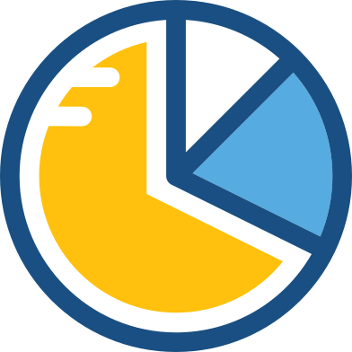
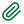

# Icons

Original icons here: https://www.svgrepo.com/

## Tool Bar

enum | Meaning  | Icon | Alternative 
:-- | :--  | :-- | :--
NEW_DB | New Database |  |    
OPEN    | Open Database |  |  
NEW_ACC    | New Account |  |  
HOME    | Home |  |
CATEGORY    | Organize Categories |  |
PAYEE    | Organize Payees |  |
CURR    | Organize Currencies |  |
FILTER    | Transaction Report Filter |  |
GRM    | General Reports Manager |  | 
OPTIONS    | Options/Settings|  |
NEW_TRX    | New Transaction |  |
NEWS    | Open News|  | 
NEW_NEWS    | New News  **Needs update**  |  | 
CURRATES    | Download Currency Rates |  | 
FULLSCREEN    | Toggle Fullscreen |  | 
PRINT    | Print |  |
ABOUT    | About |  |
HELP    | New Transaction |  |

## Navigation

enum | Meaning | Icon
:-- | :--  | :--
HOME  |  | See Toolbar
ALLTRANSACTIONS | All Transactions | 
FAVORITES | All Transactions | 
SAVINGS_ACC_NORMAL | |       
SAVINGS_ACC_FAVOURITE | Checking Accounts | 
SAVINGS_ACC_CLOSED | Checking Accounts | 
CARD_ACC | Credit Card Accounts | 
CARD_ACC_CLOSED| Credit Card Accounts | 
CASH_ACC | Cash accounts | 
CASH_ACC_CLOSED | Cash accounts | 
LOAN_ACC | Loan accounts | 
LOAN_ACC_CLOSED | Term accounts | 
TERM_ACC | Term accounts | 
TERM_ACC_CLOSED | Term accounts | 
STOCK_ACC | Stock Portfolios | 
STOCK_ACC_CLOSED | Stock Portfolios | 
ASSET | Assets |   
RECURRING | Recurring Transactions |    
BUDGET | Budgets |  
PIE_CHART | Reports | 
FILTER | Transaction Report Filter | See Toolbar
GRM | GRM Reports | See Toolbar
HELP | Help | See Toolbar

## Statuses

enum | Meaning | Icon | Alternative 
:-- | :--  | :-- | :--
RECONCILED | |  | 
DUPLICATE_STAT | |  |
FOLLOW_UP | |  |
VOID_STAT | |  |

## Others

enum | Meaning | Icon | Alternative 
:-- | :--  | :-- | :--
ART |  |  |
AUTO |  |  | 
XXX |  | Back to top | 
CAR | Asset type |  |
CASH |  |  |
CLEAR |  |  |  
CLIP | Attachments |  |
CROWID |  |  |
DOWNARROW | |  | 
EDIT_ACC | |  |   + 
EXIT | |  | 
LEFTARROWSIMPLE | |  |
RIGHTARROWSIMPLE | |  |
HOUSEHOLD_OBJ | |  |
IMPORT | |  |
JEWELLERY | |  |
LED_GREEN | |  |
LED_OFF | |  |
LED_RED | |  |
LED_YELLOW | |  |
LOSS | |  | 
OTHER | |  |
PROFIT | |  |  
PROPERTY | |  |
RIGHTARROW | | |  
RIGHTARROW_ACTIVE | |  | 
RUN |  |  |
SAVE | |  |
TRXNUM | |  |
UPARROW | |  |      
WEB | www |   |

## Menus
(Deprecated)
enum | Meaning | Icon
:-- | :--  | :--
NEW_DB | File > New Database | See Toolbar
OPEN    | File > Open Database | See Toolbar
SAVEAS | File > Save As  | 
CLEARLIST | File > Clear Recent Files |
HOME | Accounts > Account List | See Toolbar
NEW_ACC | Accounts > New Account| See Toolbar
EDIT_ACC | Accounts > Edit Account | 
REALLOCATE_ACC | Accounts > Reallocate Account | 
CURRATES | Tools > Download Rates | See Toolbar
CATEGORY | Tools > Organize Categories | See Toolbar
PAYEE | Tools > Organize Payees | See Toolbar
CURR | Tools > Organize Currency | See Toolbar
RELOCATIONS | Tools > Relocation of... | 
CATEGORY_RELOCATION | Tools > Relocation of... > Categories | 
PAYEE_RELOCATION | Tools > Relocation of... > Payees | 
BUDGET | Tools > Budget Setup | See Navigation
RECURRING | Tools > Recurring Transactions | See Navigation
ASSET | Tools > Assets | See Navigation
FILTER | Tools > Transaction Report Filter | See Toolbar
GRM | Tools > General Report Manager  | See Toolbar
CUSTOM | Tools > Custom Fields Manager | 
ENCRYPT_DB | Tools > Database > Converted Encrypted DB |  
ENCRYPT_DB_EDIT | Tools > Database > Change Encryption Password | 
FULLSCREEN | View > Toggle Fullscreen | See Toolbar
LANG | View > Switch Language | 
HELP | Help > Help | See Toolbar
COMMUNITY | Help > Community | 
PAYPAL | Help > Community > Donate via Paypal | 
FORUM | Help > Community > Forum  | 
GITHUB | Help > Community > Github  | 
SLACK | Help > Community > Slack  | 
FACEBOOK | Help > Community > Facebook | 
GOOGLE_PLAY | Help > Community > Google Play | 
NEWS | Help > Community > Newsletter | See Toolbar
NEWS | Help > Community > RSS Feed |  See Toolbar
DONATE | Help > Community > Donate via PayPal |
BUG | Help > Report A Bug | 
APPSTART | Help > Show App Start Dialog | 
UPDATE | Help > Check For Updates | 

## Not used at present, consider adding

enum | Meaning | Icon
:-- | :--  | :--
TWITTER | Help > Community > Twitter | 

